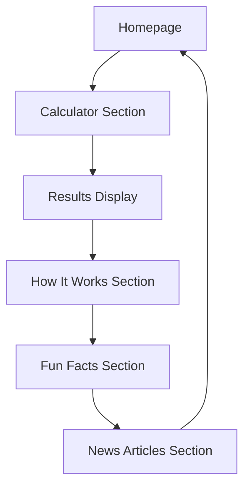

# Cat Years in Human Years Website - Product Requirements Document

## 1. Product Overview
A specialized English website that helps cat owners convert their pet's age from cat years to human years using an interactive calculator. The site provides educational content about cat aging, interesting facts, and related articles to engage cat enthusiasts.

## 2. Core Features

### 2.1 User Roles
No user registration required - all visitors can access all features as anonymous users.

### 2.2 Feature Module
Our Cat Years website consists of the following main pages:
1. **Home page**: header navigation, hero section with calculator, how it works explanation, fun facts section, news articles preview.

### 2.3 Page Details

| Page Name | Module Name | Feature description |
|-----------|-------------|---------------------|
| Home page | Header | Display site logo, navigation menu with smooth scrolling to sections |
| Home page | Calculator | Input cat age in years/months, instantly convert to human equivalent age, display result with visual indicators |
| Home page | How It Works | Explain the science behind cat aging conversion, show age comparison charts, provide detailed methodology |
| Home page | Fun Facts | Display rotating interesting facts about cats, cat aging trivia, breed-specific aging information |
| Home page | News Articles | Show latest 3-4 cat-related articles with thumbnails, titles, and brief descriptions, link to full articles |

## 3. Core Process
Visitor arrives at homepage → Uses age calculator by entering cat's age → Views conversion result → Explores how the conversion works → Reads fun facts about cats → Browses latest cat-related articles.

## 4. User Interface Design
### 4.1 Design Style
- Primary colors: Black (#000000) for text, White (#FFFFFF) for background
- Secondary colors: Dark gray (#333333) for accents, Light gray (#F5F5F5) for subtle backgrounds
- Button style: Simple rectangular buttons with black borders, minimal hover effects
- Font: Compact serif fonts (Times New Roman, Georgia) for headers, clean sans-serif (Arial, Helvetica) for body text
- Layout style: Single-page layout with distinct sections, vintage newspaper-inspired design
- Icon style: Simple line icons, minimal and classic design elements

### 4.2 Page Design Overview

| Page Name | Module Name | UI Elements |
|-----------|-------------|-------------|
| Home page | Header | Black text logo on white background, horizontal navigation menu with underline hover effects |
| Home page | Calculator | Centered input field with black border, large clear result display, vintage-style number formatting |
| Home page | How It Works | Text-heavy section with simple diagrams, black text on white background, compact paragraph spacing |
| Home page | Fun Facts | Card-based layout with black borders, rotating content display, minimal animations |
| Home page | News Articles | Grid layout with black and white thumbnails, bold headlines, compact article previews |

### 4.3 Responsiveness
Desktop-first design with mobile-adaptive layout, optimized for touch interaction on mobile devices, maintains retro aesthetic across all screen sizes.