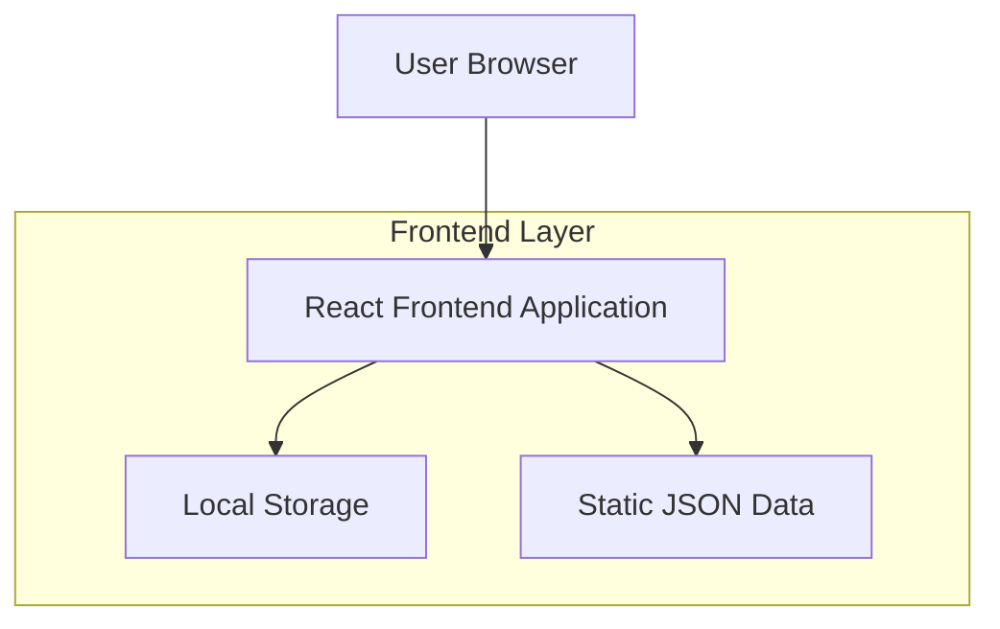
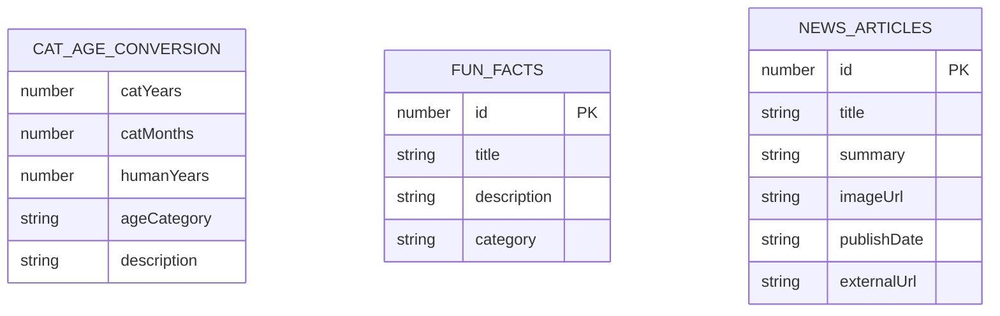

# Cat Years in Human Years Website - Technical Architecture Document

## 1. Architecture design



## 2. Technology Description
- Frontend: React@18 + tailwindcss@3 + vite
- Backend: None (Static site with client-side functionality)
- Data Storage: Local browser storage for user preferences, static JSON files for content

## 3. Route definitions

| Route | Purpose |
|-------|---------|
| / | Single-page application with all sections (header, calculator, how it works, fun facts, news articles) |

## 4. API definitions

### 4.1 Core Functions

Cat age conversion logic (client-side)
```typescript
interface CatAgeInput {
  years: number;
  months: number;
}

interface ConversionResult {
  humanYears: number;
  ageCategory: 'kitten' | 'young' | 'adult' | 'senior';
  description: string;
}

function convertCatToHumanAge(catAge: CatAgeInput): ConversionResult
```

Fun facts data structure
```typescript
interface FunFact {
  id: number;
  title: string;
  description: string;
  category: 'aging' | 'behavior' | 'health' | 'breeds';
}
```

News article data structure
```typescript
interface NewsArticle {
  id: number;
  title: string;
  summary: string;
  imageUrl: string;
  publishDate: string;
  externalUrl: string;
}
```

## 5. Data model

### 5.1 Data model definition



### 5.2 Data Definition Language

Static JSON data files (no database required)

Fun Facts Data (funFacts.json)
```json
[
  {
    "id": 1,
    "title": "Cat Aging Formula",
    "description": "The first year of a cat's life equals about 15 human years, the second year adds 9 more years, and each year after that equals about 4 human years.",
    "category": "aging"
  },
  {
    "id": 2,
    "title": "Indoor vs Outdoor Cats",
    "description": "Indoor cats typically live 12-18 years, while outdoor cats average 2-5 years due to various environmental risks.",
    "category": "health"
  }
]
```

News Articles Data (newsArticles.json)
```json
[
  {
    "id": 1,
    "title": "Understanding Your Senior Cat's Needs",
    "summary": "Learn how to care for your aging feline companion with proper nutrition and health monitoring.",
    "imageUrl": "/images/senior-cat.jpg",
    "publishDate": "2024-01-15",
    "externalUrl": "https://example.com/senior-cat-care"
  }
]
```

Age Conversion Logic (embedded in React component)
```javascript
const convertCatAge = (years, months) => {
  const totalMonths = years * 12 + months;
  
  if (totalMonths <= 12) {
    // First year: 1 cat month = 1.25 human years
    return Math.round(totalMonths * 1.25);
  } else if (totalMonths <= 24) {
    // Second year: 15 + (months-12) * 0.75
    return Math.round(15 + (totalMonths - 12) * 0.75);
  } else {
    // After 2 years: 24 + (years-2) * 4
    return Math.round(24 + (years - 2) * 4);
  }
};
```